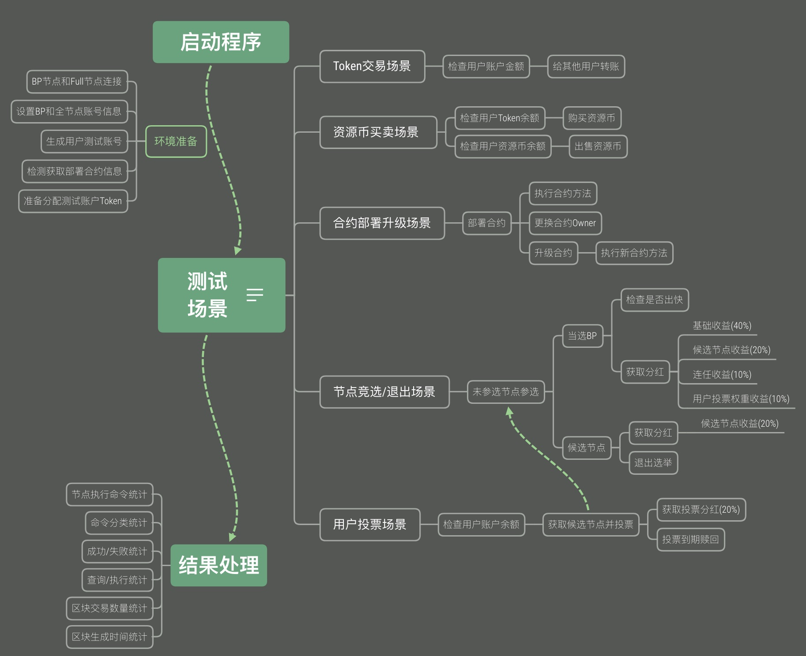

# AElf scenarios testing for contracts.

## Scenarios

### 1. Native token scenario
- [ ] Get User native token
- [ ] Transfer token each other
- [ ] Approve token and TransferFrom from others

### 2. Resource token scenario
- [ ] Check token balance and buy different resources
- [ ] Check different resources and sell

### 3. Contract deploy and update scenario
- [ ] Deploy contract
- [ ] Call contract methods
- [ ] Change contract owner
- [ ] Update contract and call new methods

### 4. Node announcement and quit election scenario
- [ ] Attend announcement election
- [ ] Check new BP node whether generate block
- [ ] BP node get all types rewards
- [ ] Candidate node get backup reward
- [ ] Candidate node quit election

### 5. User attend vote scenario
- [ ] Get candidates and vote
- [ ] Check available vote reward and release
- [ ] Check expired vote and withdraw

## Technological process

  

